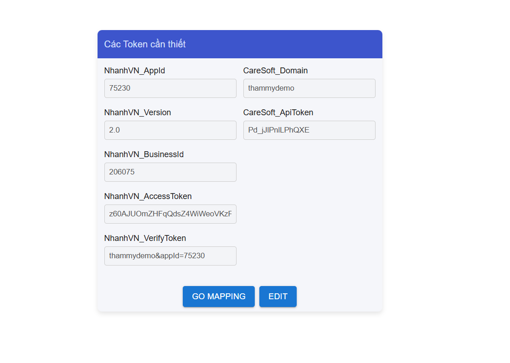
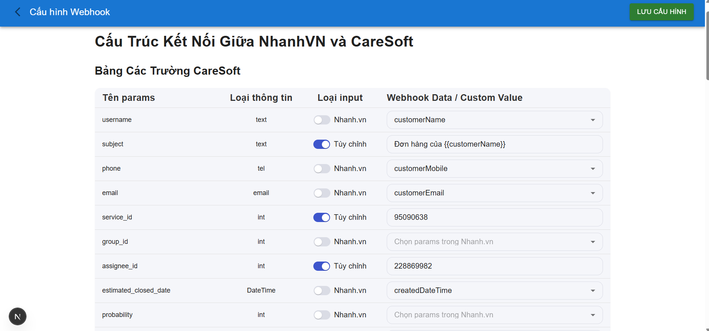
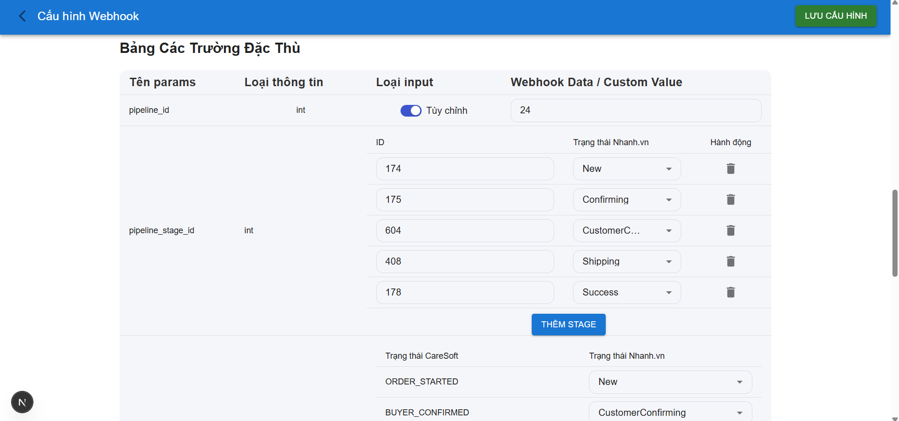
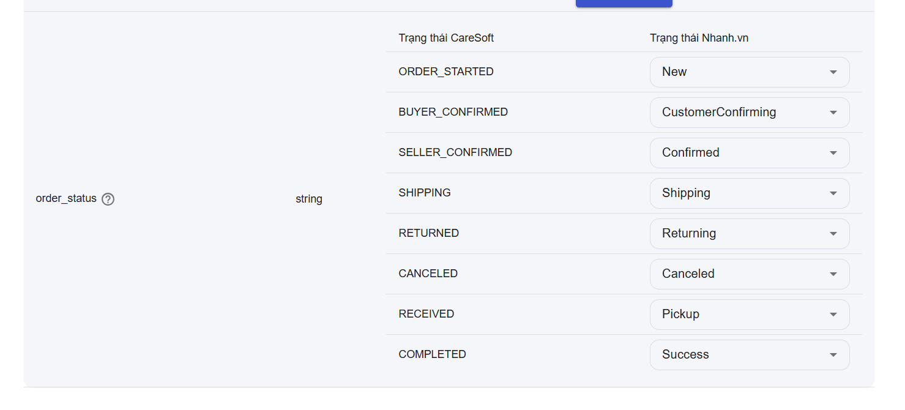
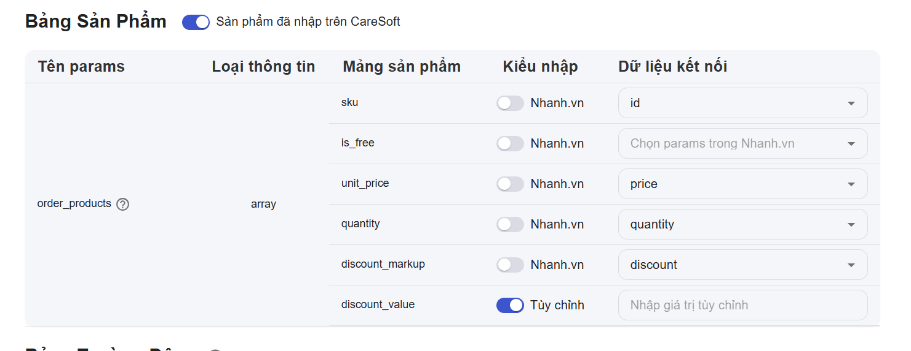
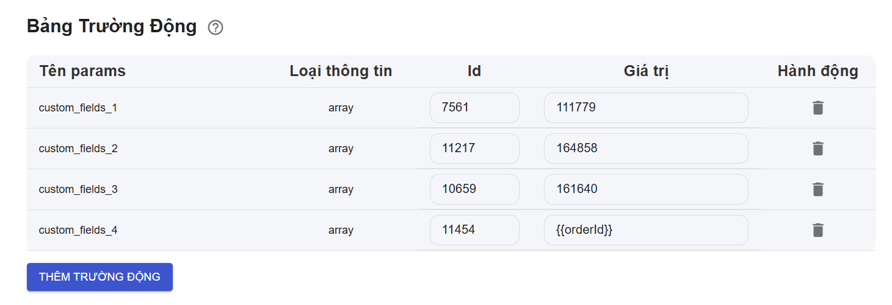

# Nhanh.vn to CareSoft Integration

## Overview

A middleware application that seamlessly integrates Nhanh.vn orders with CareSoft deals. This application serves as a bridge between Nhanh.vn's e-commerce platform and CareSoft's CRM system, automatically converting orders into deals while maintaining data synchronization.

## Key Features

- **Custom Field Mapping**: Flexible mapping configuration between Nhanh.vn and CareSoft fields
- **Automated Deal Creation**: Automatic deal creation in CareSoft from Nhanh.vn orders
- **Real-time Updates**: Synchronous order status updates between platforms
- **Customer Management**: Automatic customer information updates based on phone numbers
- **Configurable Settings**: Easy-to-use interface for API credentials and mapping setup

## Prerequisites

- Node.js (v18.20.8)
- npm (v10.8.2)
- Nhanh.vn API credentials (AppID, Version, BusinessID, AccessToken)
- CareSoft API credentials (Domain, API Token)

## Installation

1. Clone the repository:

   ```bash
   git clone https://github.com/NguyenThanhLong264/nhanh-vn.git
   ```

2. Navigate to the project directory:

   ```bash
   cd nhanh-vn
   ```

3. Install dependencies:

   ```bash
   npm install
   ```

## Configuration

1. Set up your API credentials:

   - Open the application in your browser
   - Enter your Nhanh.vn credentials (AppID, Version, BusinessID, AccessToken)
   - Enter your CareSoft credentials (Domain, API Token)
   - Click "Save" to store your credentials

2. Configure field mappings:
   - Navigate to the mapping configuration page
   - Map Nhanh.vn fields to CareSoft fields
   - Set up custom field mappings as needed
   - Save your configuration

## Running the Application

### Development Mode

```bash
npm run dev
```

### Production Mode

```bash
npm start
```

The application will be available at: [http://localhost:3000](http://localhost:3000)

## Webhook Setup

For the integration to work, you need to set up webhooks in Nhanh.vn to notify this application when orders are created or updated:

1. Configure webhooks in Nhanh.vn:
   - Go to [https://open.nhanh.vn](https://open.nhanh.vn)
   - Navigate to **My App > Choose the app > Edit the webhook**
   - Create two webhooks with the following endpoints:
     - `https://your-domain/api/webhookNhanhVN`

Note: Replace `your-domain` with your actual domain name. Ensure your endpoint is accessible via HTTPS as required by Nhanh.vn's webhook system.

## Database

The application uses SQLite to store mappings between Nhanh.vn orders and CareSoft deals. The database is automatically created and managed by the application. This feature is use for update deals if it already exsit.

## Troubleshooting

- **Webhook not receiving data**: Ensure ngrok is running and the webhook URLs are correctly configured in Nhanh.vn
- **API errors**: Verify your API credentials are correct in the application settings
- **Mapping issues**: Check the field mappings in the configuration page

## How to Use

1. **Initial Setup**

   - Install and configure the application following the installation steps above
   - Start the application using either development or production mode
   - Access the application interface at `http://localhost:3000`
   - **Ensure the application is accessible via HTTPS** (e.g., ngrok, localtunel, mkcert)

2. **API Configuration**

   - In the application interface, navigate to the API settings page
   - Enter your Nhanh.vn credentials:
      
   - Save your configuration

3. **Field Mapping Setup**

   - Go to the mapping configuration page
   - Map essential fields between Nhanh.vn and CareSoft:
      + You can choose between map with params of NhanhVN webhook, or customize. When in the customize, you can still able to use the params of Nhanh by use: {{nhanh params}}. Example: "Đơn hàng của {{customerName}}" (with {{product}}, it auto changr to the list of product in order)
      
   - Some special case:
      + pipeline_stage_id: with each id of the pipeline_stage_id, you can map it with 1 status on nhanh, and if the status recive that not mapped, it use the default of that pipeline_id.
      
      + order_status: in CareSoft we have different status, you can choose the status of nhanh to map with it.
      
      + order_products: in CareSoft we have the order_products array with it parrams, and you can choose to map with the params of product of NhanhVN. But you need to have the products both CareSoft and Nhanh have there SKU = id (then it can display on deals, if not then turn the switch to: "Sản phẩm chưa nhập trên CareSoft")
      
      + custom_fields: CareSoft have the customs fields, you need to use the correct id and value of it. Example:
      
   - Save your mapping configuration

4. **Webhook Configuration**

   - Access your Nhanh.vn account at [https://open.nhanh.vn](https://open.nhanh.vn)
   - Navigate to Settings > Webhooks
   - Add a new webhook with endpoint: `https://your-domain/api/webhookNhanhVN`
   - Replace `your-domain` with your actual domain
   - Ensure your endpoint is accessible via HTTPS

5. **Testing the Integration**

   - Create a test order in Nhanh.vn
   - Check your CareSoft account for the new deal
   - Verify all mapped fields are correctly populated
   - Test order status updates to ensure synchronization

6. **Monitoring and Maintenance**
   - Regularly check the application logs for any errors
   - Monitor webhook delivery status in Nhanh.vn
   - Verify deal creation and updates in CareSoft
   - Update field mappings as needed
